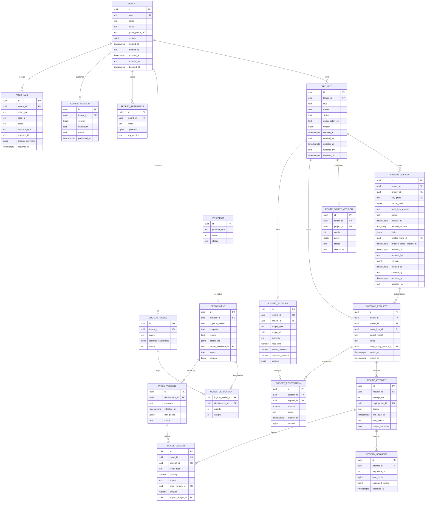

# 数据库 ER 设计草案

> 状态：Proposed  
> 日期：2026-07-30  
> 对应任务：P01-T07

## 1. ER 图

## 2. 关键约束

- `tenant(slug)` 全局唯一；`project(tenant_id, slug)` 唯一。
- `project(tenant_id, lower(name))` 大小写不敏感唯一。
- `project(tenant_id, id)` 唯一，供后续子表建立租户隔离复合外键。
- `virtual_api_key(key_prefix)` 全局唯一；`(hash_key_version, secret_hash)` 唯一，Hash 强制为 32 字节 keyed digest。
- `virtual_api_key(tenant_id, project_id)` 通过复合外键引用 Project，轮换自引用也必须位于同一 Tenant/Project；一个旧 Key 最多有一个替代 Key。
- `logical_model(tenant_id, name)` 唯一。
- `model_deployment(logical_model_id, deployment_id)` 唯一。
- `price_version(deployment_id, effective_at)` 唯一。
- `route_policy_version(project_id, version)` 唯一。
- `route_attempt(request_id, attempt_no)` 唯一。
- `stream_segment(attempt_id, sequence_no)` 唯一。
- `usage_ledger(event_id)` 唯一。
- 活跃预算预留可以用 `(request_id, account_id, status)` 与业务约束防重复。

## 3. 索引建议

- `gateway_request(tenant_id, project_id, started_at desc, id)`。
- `gateway_request(tenant_id, status, started_at)`。
- `route_attempt(request_id, attempt_no)`。
- `route_attempt(deployment_id, started_at, status)`。
- `usage_ledger(attempt_id, created_at)`。
- `budget_reservation(status, expires_at)` 用于 Reaper。
- `audit_log(tenant_id, occurred_at desc, id)`。

## 4. 分区与保留

- MVP 不提前分区，先通过测试数据确定规模。
- Request/Attempt/Ledger/Audit 达到量级后按月分区。
- Prompt/Response 不进入这些表。
- ClickHouse 保存查询副本，PostgreSQL 保留可审计的核心事实。

## 5. 并发策略

- 可修改配置实体使用 `version` 乐观锁。
- BudgetAccount 预留使用原子条件更新或短事务行锁。
- Ledger 通过 eventId 唯一约束实现最终幂等。
- 已发布配置/价格记录不更新，创建新版本。
