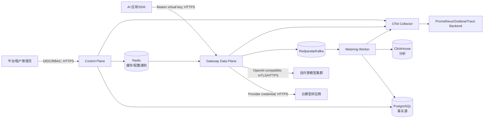

# 系统上下文与信任边界

> 状态：Accepted  
> 日期：2026-07-30  
> 对应任务：P01-T02

## 1. 系统上下文

## 2. 信任边界

### TB-1 公网/客户端到数据面

- 客户端持有虚拟 Key，不持有供应商真实 Key。
- 所有身份、租户、项目和模型范围由服务端从 Key 元数据得出。
- 请求正文不可信，必须限制大小、字段和流行为。

### TB-2 管理用户到控制面

- 使用独立的 OIDC/RBAC，不复用数据面虚拟 Key 作为平台管理凭证。
- Key、Provider、价格、路由、预算和导出属于高敏操作并写审计。

### TB-3 数据面到外部 Provider

- Endpoint、DNS、证书、重定向和出站网络均属于不可信边界。
- 防 SSRF、DNS 重绑定和云元数据访问。
- 仅向选定 Provider 发送当前请求所需内容。

### TB-4 同步请求链路到异步计量/分析链路

- 请求成功不依赖 ClickHouse。
- 用量事件至少一次投递，Metering Worker 必须幂等。
- 队列不可用时采用受限 Outbox/缓冲并触发告警，不能无限堆积。

### TB-5 控制面事实源到数据面配置快照

- PostgreSQL 是配置事实源。
- 数据面只使用校验通过、带版本和校验和的不可变 Snapshot。
- 控制面故障时可用最近有效配置，但超过陈旧阈值必须告警。

## 3. 组件职责

| 组件 | 同步职责 | 不承担的职责 |
|---|---|---|
| Gateway | 认证、策略、限流、预算预留、路由、代理、Attempt、用量事件 | 报表聚合、长期分析 |
| Control Plane | 资源管理、配置校验、版本发布、审计 | 每个请求的热路径决策 |
| Metering Worker | 幂等计量、Usage Ledger、预算结算、分析投递 | 模型代理 |
| PostgreSQL | 配置、预算、Request/Attempt/Ledger 事实 | 高吞吐全文分析 |
| Redis | 限流、并发、配置缓存/通知 | 预算和历史账本最终事实 |
| Redpanda/Kafka | 用量和异步事件 | exactly-once 承诺 |
| ClickHouse | 明细分析和聚合报表 | 请求授权与预算硬限制 |

## 4. 关键数据流

| 编号 | 流程 | 敏感数据 | 保护 |
|---|---|---|---|
| DF-1 | App → Gateway | 虚拟 Key、Prompt、工具 Schema | TLS、Header 脱敏、大小限制 |
| DF-2 | Gateway → Provider | Provider Key、Prompt | TLS、Endpoint 白名单、最小字段 |
| DF-3 | Gateway → Event Bus | Token、状态、成本、租户 ID | 不含 Key/正文，事件版本、ACL |
| DF-4 | Admin → Control Plane | 身份、价格、策略、密钥引用 | OIDC、RBAC、CSRF/审计 |
| DF-5 | Control Plane → Gateway | 配置快照 | 签名/校验和、版本、最小密钥引用 |
| DF-6 | Metering → ClickHouse | 用量与聚合维度 | 租户隔离、保留期限、无正文 |
| DF-7 | Services → Telemetry | Trace/Metric/Log | 统一脱敏、Label 基数限制 |

## 5. 事实源与一致性

- 配置：PostgreSQL → 版本 Snapshot → Redis/事件通知 → Gateway。
- 预算：PostgreSQL 账本/预留为事实；Redis 可做快速保护但不能单独决定最终余额。
- 请求：GatewayRequest 与 RouteAttempt 进入 PostgreSQL；异步路径需要可恢复策略。
- 用量：不可变 Usage Ledger 为成本事实；ClickHouse 是查询副本。
- 路由健康：实例内滑动窗口 + 聚合状态，允许短暂最终一致。

## 6. 主要故障隔离

- Control Plane 失败：Gateway 使用最近有效 Snapshot。
- ClickHouse 失败：调用继续；分析事件积压并告警。
- Provider 失败：首包前按政策切换；首包后部分失败。
- Redis 失败：根据策略 fail-closed 或使用本地保护；硬预算不能绕过。
- Event Bus 失败：进入受限 Outbox；达到安全上限时按租户策略拒绝或降级，避免完全丢失计量。
- PostgreSQL 失败：不能可靠预留预算时，受预算约束的请求 fail-closed。

