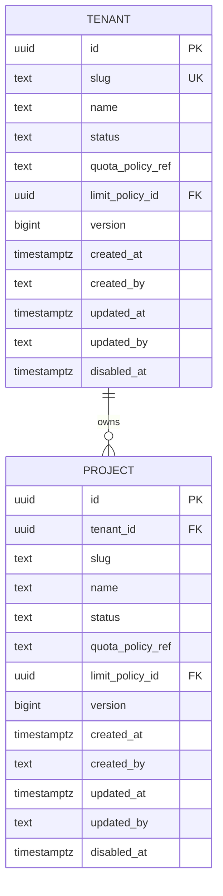

# Tenant 与 Project 数据库 Schema

> 状态：Implemented
>
> 日期：2026-07-30
>
> 对应任务：P04-T01、P09-T01 / 迁移 `000002_create_tenants_projects`、`000010_create_limit_policies`

## 1. 隔离关系

Tenant 是最高隔离根。Project 的 `tenant_id` 不可空，外键采用 `ON UPDATE/DELETE RESTRICT`；不能通过删除 Tenant 级联清掉项目和后续用量/账本事实。

`projects(tenant_id, id)` 额外建立唯一约束，供 Virtual Key、模型授权、请求等后续表使用 `(tenant_id, project_id)` 复合外键，数据库层同时证明“资源存在”和“属于同一 Tenant”。

## 2. 状态与禁用时间

Tenant/Project 使用相同状态集合：

- `active`：允许正常使用。
- `suspended`：临时阻止数据面使用，可恢复；`disabled_at` 必须为空。
- `disabled`：明确禁用；`disabled_at` 必须存在且不早于 `created_at`。

Schema 用 CHECK 保证 `status='disabled'` 与 `disabled_at IS NOT NULL` 等价，避免应用遗漏时间事实。

## 3. 限额策略引用

- Tenant `limit_policy_id=NULL` 表示继承完整平台策略。
- Project `limit_policy_id=NULL` 表示继承 Tenant 层；非空引用 Tenant 内的稀疏覆盖策略。
- Tenant 使用 `(id, limit_policy_id)`、Project 使用 `(tenant_id, limit_policy_id)` 复合外键，数据库拒绝跨 Tenant 策略绑定。
- 旧 `quota_policy_ref` 在 expand 阶段暂时保留；同一行不能同时设置旧引用与新 `limit_policy_id`。迁移完成后由后续独立 contract 迁移删除，不复用它存 JSON。
- 继承与最终 `soft <= hard` 校验由 `internal/limitpolicy.Resolve` 统一完成，详见 [`limit-policy-schema.md`](limit-policy-schema.md)。

## 4. 唯一性与命名

- Tenant `slug` 全局唯一；slug 强制 3～63 位小写字母、数字、连字符，首尾必须是字母或数字。
- Project `slug` 在 Tenant 内唯一。
- Project `name` 使用 `(tenant_id, lower(name))` 唯一索引，避免 `Primary App`/`primary app` 形成控制面歧义。
- Project 主键仍全局唯一；租户内复合唯一用于后续隔离外键，而不是替代主键。

## 5. 审计与并发

- `created_at/created_by/updated_at/updated_by` 全部必填；时间由数据库提供安全默认值，Actor 必须由写入方显式提供。
- `updated_at >= created_at`，Actor 去除首尾空格后长度为 1～200。
- `version` 从 1 开始且必须为正，由应用使用 `WHERE id=? AND version=?` 乐观更新并递增；数据库不使用隐藏触发器自动修改。

## 6. 索引

- `tenants(status, created_at DESC, id)`：平台管理列表与状态扫描。
- `projects(tenant_id, status, created_at DESC, id)`：强制以 Tenant 为首列的项目列表。
- 唯一索引同时服务 Tenant slug、Tenant 内 Project slug/name 查询。

不建立无 Tenant 前缀的 Project 列表索引，避免后续 Repository 轻易写出跨租户扫描。

## 7. 验证

`TestTenantProjectSchemaConstraints` 在可抛弃 PostgreSQL 中验证：

- 迁移版本 `0 -> 2 -> 1 -> 2` 且 dirty=false。
- Tenant slug、Project tenant+slug、Project tenant+lower(name) 唯一。
- Project 外键、Tenant 受限删除、状态与禁用时间 CHECK。
- 同名 Project 可存在于不同 Tenant。
- 配额覆盖/NULL 继承语义、版本和审计时间默认值。

测试只使用合成 UUID，并在结束时删除 Fixture；验证数据库本身也在本地流程 finally 中删除。
