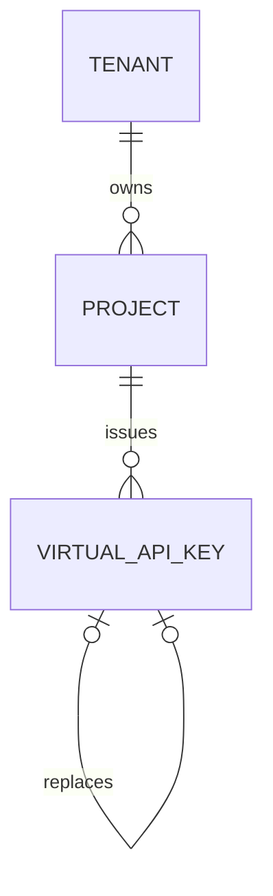
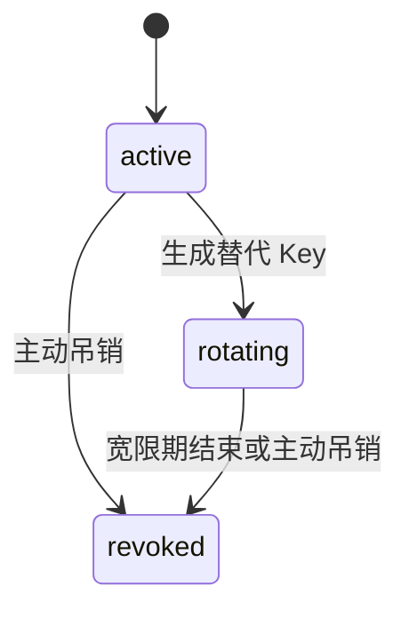

# Virtual API Key 数据库 Schema

> 状态：Implemented
>
> 日期：2026-07-30
>
> 对应任务：P04-T02、P09-T01 / 迁移 `000003_create_virtual_api_keys`、`000010_create_limit_policies`

## 1. 安全存储边界

数据库只保存：

- `key_prefix`：用于定位候选记录、审计和客服沟通的非秘密标识，格式为 `agw_live_*` 或 `agw_test_*`。
- `secret_hash`：服务端使用独立摘要密钥计算的 32 字节 keyed digest；它不是可解密密文。
- `hash_key_version`：摘要密钥的版本标识，只用于选择外部密钥材料，不包含密钥本身。

表中不存在 `secret`、`raw_key`、`api_key`、`ciphertext` 等可恢复凭据字段。P04-T03 创建 Key 时，完整凭据只能在生成流程中返回一次；日志、错误、审计和数据库均不得接收它。

`(hash_key_version, secret_hash)` 唯一约束阻止同一摘要身份被重复登记。`secret_hash` 强制恰好 32 字节，使错误算法、截断摘要或误把明文写入字段的操作立即失败。

## 2. 租户与项目隔离

- `(tenant_id, project_id)` 复合外键引用 `projects(tenant_id, id)`，因此存在的 Project ID 也不能与错误 Tenant 拼接。
- `(tenant_id, project_id, rotated_from_id)` 复合自引用保证新旧 Key 位于同一 Tenant 和 Project。
- Tenant、Project 和轮换来源均使用 `ON UPDATE/DELETE RESTRICT`，防止级联删除身份与审计事实。
- `(tenant_id, project_id, id)` 是后续请求、审计和授权子表可复用的隔离外键目标。

## 3. 生命周期状态机

状态及数据库事实：

- `active`：不得存在轮换宽限或吊销字段。
- `rotating`：`rotation_grace_expires_at` 必填且晚于创建时间；吊销字段必须为空。
- `revoked`：`revoked_at` 和 `revoked_by` 必填，轮换宽限必须清除。
- `expires_at` 是独立的派生有效性边界，必须晚于创建时间；过期不依赖后台任务把状态改为 `expired`。
- `rotated_from_id` 表示“当前 Key 替代哪个旧 Key”。部分唯一索引保证一个旧 Key 最多生成一个正式替代者，并禁止自引用。

数据库负责单行状态和关系完整性；“替代 Key 写入与旧 Key 切换为 rotating 必须同一事务”等跨行原子规则由 P04-T03 服务实现和并发测试保证。

## 4. 模型授权覆盖

`allowed_models` 是一维、最多 256 项的模型标识数组：

- `NULL`：继承 Project 模型白名单。
- 空数组：明确禁止全部模型。
- 非空数组：Key 级覆盖；标识最长 128 字符，只允许字母、数字、点、下划线、冒号、斜杠和连字符。
- 大小写不敏感去重，避免 `chat.default` 与 `CHAT.DEFAULT` 形成授权歧义。

数据库函数 `app.valid_virtual_key_allowed_models` 被 CHECK 约束调用；不能通过绕开控制面直接写入非法或重复模型。

## 5. Key 级限额覆盖

`limits` 采用受限 JSONB，避免在 P09 策略模型落地前固化大量稀疏列：

- `NULL`：继承 Project 限额。
- 允许的键只有 `rpm`、`tpm`、`concurrency`。
- 每个值必须是 1～18 位正整数；禁止零、负数、小数、字符串、布尔值和未知键。
- 空对象表示没有 Key 级字段覆盖；与 `NULL` 的继承意图仍可区分。

`app.valid_virtual_key_limits` 只校验旧存储形状。P09-T01 新增 Tenant 复合外键保护的 `limit_policy_id`，指向具有独立 soft/hard 边界的稀疏 LimitPolicy；`NULL` 继承 Project 层。expand 阶段保留 `limits`，但数据库禁止同一 Key 同时设置 `limits` 与 `limit_policy_id`。

继承固定为 Platform → Tenant → Project → Key，最终合并及 `soft <= hard` 校验只由 `internal/limitpolicy.Resolve` 完成。旧 JSON 的迁移和删除属于后续 migrate/contract 步骤，详见 [`limit-policy-schema.md`](limit-policy-schema.md)。

## 6. 审计、并发与索引

- `created_at/created_by/updated_at/updated_by` 全部必填，Actor 去除首尾空格后长度为 1～200。
- `version` 从 1 开始，由应用使用 compare-and-swap 乐观更新；数据库不使用隐藏触发器。
- `key_prefix` 全局唯一索引用于认证候选定位。
- `(tenant_id, project_id, status, created_at DESC, id)` 用于租户内管理列表。
- 对未吊销且设置过期时间的 Key 建立部分索引，支持过期扫描。
- 对 `rotating` Key 的宽限截止时间建立部分索引，支持轮换收敛任务。

## 7. 验证矩阵

`TestVirtualAPIKeySchemaConstraints` 在迁移到最新版本的可抛弃 PostgreSQL 中验证：

- 正常 Key、白名单、限额、摘要和审计版本可写可读。
- Schema 不存在可恢复明文字段，摘要长度必须为 32 字节。
- 重复前缀、重复摘要和跨 Tenant/Project 外键被拒绝。
- 重复/非法模型、未知/非正整数/小数限额被拒绝。
- 缺少宽限期的 rotating、缺少 Actor/时间的 revoked、创建时已经过期的记录被拒绝。
- 自轮换、跨租户轮换和一个旧 Key 的多个替代者被拒绝。
- 迁移状态执行 `0 -> 3 -> 2 -> 3`，且每一步 `dirty=false`。
