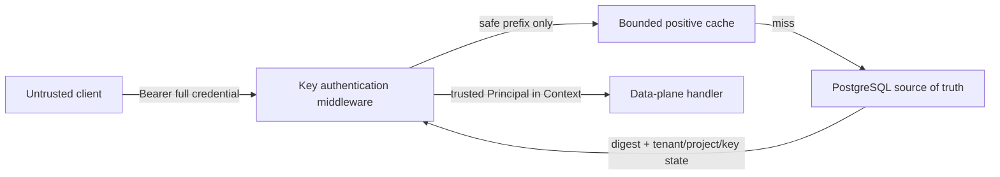

# Virtual Key 数据面认证

> 状态：Implemented
>
> 日期：2026-07-30
>
> 对应任务：P04-T04

## 1. 信任边界

客户端只能提供完整凭据，不能声明可信 Tenant、Project 或 VirtualKey。Middleware 在成功后删除 `Authorization`、`X-Tenant-Id`、`X-Project-Id` 和 `X-Virtual-Key-Id`，再把数据库产生的深拷贝 Principal 放入 Context。

业务 Handler 不解析身份 Header，也不能用请求参数替代 Principal。这样即使攻击者填写另一个真实 Tenant/Project ID，后续 Repository 仍只能使用已认证作用域。

## 2. 决策流程

1. 要求恰好一个 Bearer Header，总长度有界。
2. 严格解析安全前缀、单个点号和规范 base64url Secret；Secret 必须恰好 32 字节。
3. 以全局唯一安全前缀读取正缓存或 PostgreSQL；未知前缀仍执行一次 dummy HMAC 工作。
4. 按记录的 `hash_key_version` 选择当前或显式保留的 Keyring 项。
5. 计算 `HMAC-SHA-256(prefix || 0x00 || secret)` 并用 `hmac.Equal` 常量时间比较摘要。
6. 要求 Tenant/Project 为 `active`。
7. 要求 Key 未吊销、未到绝对过期时间；若为 `rotating`，当前时间必须早于宽限截止。
8. 生成可信 Principal，清零解析后的 Secret，再调用下游 Handler。

摘要验证发生在状态检查前；公开响应不区分哪一项失败，降低 Key 枚举和状态探测价值。

## 3. 公开失败语义

| 场景 | HTTP | 稳定错误码 | 可重试 |
|---|---:|---|---|
| 缺失/多值/格式错误 | 401 | `INVALID_API_KEY` | 否 |
| 未知前缀/错误 Secret | 401 | `INVALID_API_KEY` | 否 |
| Key 吊销/绝对过期/宽限结束 | 401 | `INVALID_API_KEY` | 否 |
| Tenant/Project suspended 或 disabled | 401 | `INVALID_API_KEY` | 否 |
| PostgreSQL 故障/记录损坏/Keyring 缺版本 | 503 | `AUTHENTICATION_UNAVAILABLE` | 是 |

所有失败都带 `WWW-Authenticate: Bearer realm="ai-gateway"`，错误不包含前缀、Secret、摘要、作用域、数据库地址或缺失版本。

## 4. 缓存一致性

`MemoryCache` 只保存按安全前缀索引的正向认证 Record：

- TTL 默认 2 秒，可配置 `0s`～`30s`；`0s` 完全禁用。
- 固定最大容量 10,000；满时淘汰最早写入项，不允许攻击者造成无界内存。
- Set/Get 都深拷贝摘要、模型列表和限额，调用方不能修改共享缓存。
- `Invalidate(prefix)` 用于吊销、轮换和配置变更消费者主动删除。
- 不做负缓存，未知前缀不会长期占据内存或阻止刚创建 Key 生效。
- 每次命中仍用当前时钟检查绝对过期和轮换宽限，因此这些安全窗口不会被 TTL 延长。

尚未接入跨进程主动失效总线时，TTL 是吊销和 Tenant/Project 状态变更的最大陈旧窗口。高安全部署可设 `0s`；后续发布配置会通过 PostgreSQL/Redis 通知调用 `Invalidate`，但认证正确性不依赖通知永不丢失。

## 5. Keyring 升级

Keyring 接受一个 current 版本和零到多个 retained 版本。签发只使用 current，认证可以验证迁移期旧摘要；重复版本、非法标识和非 32 字节根密钥在启动时拒绝。数据库存在未知版本时返回 503 而非把配置错误误判为客户凭据错误。

当前环境配置提供一个版本；多版本秘密来源在密钥轮换/KMS 阶段接入，Keyring 契约无需改动。

## 6. 验证矩阵

- 单元测试：严格 Header/凭据解析、错误 Secret、未知前缀、统一 401、安全 503、当前/保留版本、状态与时钟、Header 剥离、缓存深拷贝/容量/TTL/显式失效。
- 真实 PostgreSQL：从 P04-T03 签发贯通认证，覆盖吊销、过期、轮换宽限、Tenant suspended、Project disabled、另一个真实租户的伪造 Header 和缓存失效。
- Linux CI：普通与 integration build-tag lint、race detector、进程生命周期、PostgreSQL 强制套件和密钥扫描。
