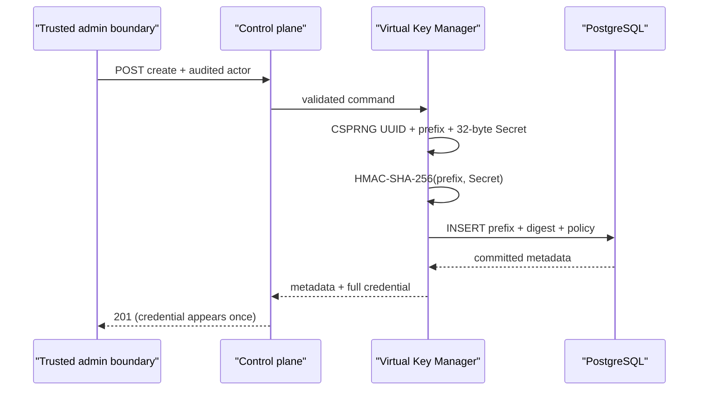

# Virtual Key 生命周期

> 状态：Implemented
>
> 日期：2026-07-30
>
> 对应任务：P04-T03

## 1. 一次性签发



完整凭据由 `agw_live_*`/`agw_test_*` 安全前缀、点号和 32 字节 base64url Secret 组成。ID、前缀和 Secret 均来自操作系统 CSPRNG；UUID 设置 RFC 4122 version/variant 位。

`Manager` 只在 INSERT 成功后返回完整凭据。随机身份碰撞最多重新签发三次；失败尝试的明文从不返回。持久化 `Record` 只有摘要且 `SecretHash` 带 `json:"-"`，控制面查询只返回 `Metadata`。

## 2. 摘要与密钥版本

摘要为 `HMAC-SHA-256(key_version, prefix || 0x00 || raw_secret)`：

- 前缀参与 MAC，避免相同 Secret 在不同公共身份间替换。
- 数据库保存固定 32 字节摘要和非秘密 `hash_key_version`，没有可逆密文。
- Digester 构造时复制根密钥；控制面随后清零配置临时切片。
- 测试、预发布和生产缺少显式 `VIRTUAL_KEY_HASH_KEY` 时 fail closed。
- 仅本地 development 允许从 `LOCAL_ENVELOPE_KEY` 通过版本化上下文标签派生域分离 Key，方便不提交秘密的本地启动。

P04-T04 认证读取 `hash_key_version` 选择 Keyring 项并使用常量时间比较；当前 P04-T03 只负责签发侧。

## 3. 原子轮换

```mermaid
sequenceDiagram
    participant A as "Rotation A"
    participant B as "Rotation B"
    participant DB as "PostgreSQL"
    A->>DB: SELECT source FOR UPDATE
    B->>DB: SELECT source FOR UPDATE (wait)
    A->>DB: source -> rotating + grace; INSERT replacement
    A->>DB: COMMIT
    DB-->>B: lock acquired; source is rotating
    B-->>B: ErrAlreadyRotated
```

一个事务完成：

1. 以 Tenant/Project/ID 锁定旧 Key。
2. 拒绝已吊销、已过期或已进入轮换的来源。
3. 将旧 Key 改为 `rotating`，设置 1～86400 秒宽限截止时间并递增版本。
4. 插入替代 Key，继承绝对过期时间、模型白名单和限额，并写入 `rotated_from_id`。
5. 提交后才返回替代 Key 的一次性明文。

行锁阻止并发读取旧状态，数据库 `rotated_from_id` 唯一索引提供第二道防线；插入失败会回滚旧 Key 状态。真实 PostgreSQL 测试并发发起两次轮换，断言恰好一次成功、一次 `ErrAlreadyRotated`、替代行只有一条。

## 4. 吊销与过期

- 吊销锁定目标行，写入 `revoked_at/revoked_by`、清除轮换宽限并递增版本。
- 对已经吊销的 Key 重复调用不改版本、Actor 或时间，返回第一次吊销事实，便于安全重试。
- 绝对过期不写 `expired` 状态；当 `now >= expires_at` 时，`effective_status=expired`。
- 当旧 Key 仍是 `rotating` 且 `now >= rotation_grace_expires_at` 时，`effective_status=rotation_grace_elapsed`。
- `revoked` 优先于时间派生；吊销是不可逆安全事实。

读取时派生避免后台任务延迟扩大凭据有效窗口。后续清理任务可以做数据维护，但认证决策不得依赖它是否运行。

## 5. HTTP 与信任边界

- 创建、查询、轮换、吊销路径都包含 Tenant 和 Project，Store 查询重复携带同样的复合作用域。
- 写操作要求 `X-Admin-Actor`，只把它作为可信管理认证层解析后的审计身份；Header 本身不是认证机制。
- OpenAPI 将完整 `credential` 标为 `writeOnly`，只出现在创建/轮换 201 响应。
- JSON 严格拒绝未知字段、多值、非 JSON Content-Type 和超过 64 KiB 的 Body。
- PostgreSQL cause、连接串、摘要和完整凭据不会进入公开错误。
- P12 接入管理面 OIDC/RBAC 前，control-plane 只能位于受信网络，不得直接暴露到公网。

## 6. 验证证据

- 单元测试覆盖摘要前缀绑定、调用方密钥切片复制、输入边界、碰撞重试、一次性响应和安全错误。
- `TestVirtualKeyLifecycle` 在可抛弃 PostgreSQL 中覆盖创建、明文不落库、授权/限额继承、事务轮换、并发单替代者、幂等吊销和未来时钟过期。
- CI 的 Linux Job 强制 race detector；PostgreSQL Job 强制执行 Schema 与生命周期集成测试。
