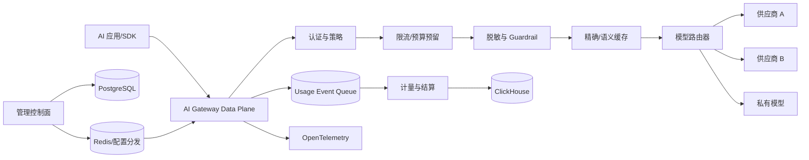

# AI 网关与模型成本治理平台——项目开发大纲

> 项目定位：为企业内部应用提供统一的大模型访问入口，屏蔽不同供应商协议差异，完成认证、配额、智能路由、故障切换、流式代理、成本核算、敏感数据治理和可观测性。
>
> 推荐技术路线：Go 1.26 + 标准 `net/http`/chi，PostgreSQL、Redis、Kafka/Redpanda、ClickHouse、OpenTelemetry、Prometheus、Grafana、Docker、Kubernetes。

## 1. 项目背景与价值

企业在接入多个大模型后，常见问题包括：每个业务系统重复适配 SDK；API Key 分散保存；无法按部门统计 Token 和费用；单一模型限流或故障时业务直接失败；Prompt 可能包含个人信息、源代码和商业数据；业务方难以判断应该选择高质量模型还是低成本模型。

AI 网关位于业务应用与模型供应商之间，提供兼容协议、统一治理和审计能力。它不是简单的反向代理，而是面向大模型流式请求、Token 计量、模型能力差异和隐私风险设计的企业基础设施。

该项目适合后端简历，因为它同时包含：

- 高并发 HTTP/SSE 代理、连接池、背压和取消传播。
- 动态路由、限流、熔断、重试和多供应商故障切换。
- Token 计量、价格版本、配额冻结与费用对账。
- 多租户、密钥管理、内容脱敏、审计和合规。
- 缓存、异步日志、列式分析和完整可观测性。

## 2. 建设目标与范围

### 2.1 核心目标

1. 对外提供统一的 OpenAI-compatible Chat/Embedding 接口。
2. 支持多个供应商与自建模型，统一模型目录和能力标签。
3. 支持按租户、项目、API Key、用户进行认证、限流和预算控制。
4. 支持流式响应透明转发、客户端取消和上游连接释放。
5. 支持基于质量、延迟、成本、配额和健康状态的路由。
6. 提供重试、熔断、降级和跨供应商故障切换。
7. 完成请求计量、Token 统计、价格版本和费用报表。
8. 支持敏感数据检测、脱敏、审计和租户数据隔离。

### 2.2 MVP 范围

- 租户、项目、用户和虚拟 API Key。
- 统一模型目录及供应商配置。
- Chat Completions 的非流式与 SSE 流式代理。
- 固定路由、权重路由和健康检查。
- 请求级限流、并发限制和日/月 Token 配额。
- 上游超时、有限重试、熔断和故障模型切换。
- 请求日志、Token 统计、费用估算和基础 Dashboard。
- API Key 加密存储、日志脱敏和管理操作审计。

### 2.3 二期范围

- Embeddings、Responses、图像、语音等接口。
- 语义缓存、Prompt 模板、Guardrail 和内容分类。
- 基于策略的智能路由与在线质量反馈。
- 预算告警、充值/结算或内部成本分摊。
- 自定义插件、Webhook、模型评测和 A/B 实验。
- 企业 SSO、组织架构同步与审批式密钥申请。

### 2.4 明确不做

- 第一版不训练或微调模型。
- 不承诺所有供应商协议完全等价；对不支持的参数明确返回兼容性错误。
- 不对带副作用的工具调用自动跨模型重试，除非调用链具有幂等保证。
- 不把完整 Prompt/Response 默认写入日志。
- 不让大模型自行决定认证、预算和数据访问权限。

## 3. 用户角色与典型场景

| 角色 | 需求 | 权限边界 |
|---|---|---|
| 平台管理员 | 接入供应商、制定全局策略、查看容量 | 不默认查看业务明文内容 |
| 租户管理员 | 管理项目、成员、预算、模型白名单 | 仅操作本租户资源 |
| 项目负责人 | 创建虚拟 Key、查看费用和错误 | 仅查看项目范围数据 |
| 应用开发者 | 通过兼容 API 调用模型 | 无权读取真实供应商 Key |
| 安全审计员 | 查看策略命中和配置变更 | 内容访问需单独授权 |
| 财务/运营 | 查看成本、预算、供应商对账 | 不查看 Prompt 正文 |

### 3.1 典型场景

#### 场景 A：内部知识助手

业务使用统一 API 调用模型。网关先校验项目预算和模型白名单，执行敏感数据策略，选择满足长上下文要求且成本可控的模型，并记录 Token、延迟和费用。

#### 场景 B：模型故障切换

主模型连续超时或返回 429，熔断器打开。对于尚未向客户端输出任何内容的请求，网关切换到同能力等级的备用模型；已开始流式输出的请求不进行无缝切换，返回结构化错误并允许应用重试。

#### 场景 C：部门预算治理

研发、客服和市场各自拥有项目预算。达到 80% 时告警，达到硬上限后拒绝高价模型或切换到低成本模型。费用按照请求发生时生效的价格版本计算，避免历史账单随价格调整而变化。

## 4. 功能需求

### 4.1 统一 API

- 兼容 `/v1/chat/completions`，支持 messages、temperature、max_tokens、tools 和 stream 等常用字段。
- 支持网关扩展 Header：项目、路由策略、请求幂等键、是否允许缓存等。
- 统一错误码，将供应商错误映射为认证失败、限流、配额不足、上下文过长、内容策略、上游超时和模型不可用。
- 响应返回网关 requestId、选择的逻辑模型、用量和可选成本信息。
- 上游供应商特有参数放入受控扩展字段，并通过模型能力 Schema 校验。

### 4.2 模型目录

- 逻辑模型与物理部署分离。应用调用 `general-chat-large`，网关可映射到不同供应商部署。
- 能力标签包含：上下文长度、工具调用、结构化输出、视觉、流式、区域和数据策略。
- 每个 Deployment 配置供应商、地址、真实模型名、密钥引用、超时、权重、优先级和单位价格。
- 配置发布生成不可变版本，路由决策记录实际使用的版本。

### 4.3 虚拟 API Key

- Key 只在创建时展示一次，数据库存哈希和标识前缀。
- 可绑定租户、项目、允许模型、有效期、IP 范围、RPM/TPM、并发数和预算。
- 支持启用、禁用、轮换和最后使用时间。
- 每次调用生成主体上下文，禁止客户端伪造 tenantId/projectId。

### 4.4 路由策略

- 固定路由：指定逻辑模型或部署。
- 加权路由：用于容量分散或 A/B 测试。
- 最低延迟：在满足能力和预算的候选中选择近期延迟较低者。
- 最低成本：选择满足质量等级的最低单价部署。
- 优先级故障切换：主部署不可用时按顺序选择备用。
- 区域路由：敏感数据只允许进入指定区域或私有部署。

### 4.5 限流与配额

- RPM：每分钟请求数。
- TPM：每分钟输入与输出 Token。
- 并发限制：控制正在执行的上游请求数。
- 日/月预算：支持软告警和硬限制。
- 维度：租户、项目、API Key、用户、逻辑模型和物理部署。
- 分布式限流使用 Redis Lua 或令牌桶；本地限流作为第一层快速保护。

### 4.6 调用日志与报表

- 记录 requestId、租户、项目、逻辑/物理模型、开始时间、首 Token 延迟、总延迟、状态、Token、估算费用、缓存命中和策略命中。
- 默认不保存 Prompt/Response；按租户策略保存哈希、长度、分类标签或脱敏采样。
- 支持按日期、项目、模型、状态码、延迟区间和供应商查询。
- 成本报表展示每日趋势、Top 项目、Top 模型、缓存节省和预算使用率。

## 5. 非功能需求

### 5.1 性能目标

- 网关自身非流式附加延迟 P95 小于 30ms，不包含模型耗时。
- 流式首包代理附加延迟 P95 小于 50ms。
- 单实例目标支持至少 1,000 条并发 SSE 连接，最终数值由真实压测确定。
- 管理配置变更在 5 秒内同步到所有网关实例。
- 调用日志异步写入，分析系统故障不应阻断模型调用。

### 5.2 可用性目标

- 数据面和控制面分离；控制面暂时不可用时，数据面使用最近一次有效配置继续服务。
- 网关无状态部署，配置缓存包含版本和过期策略。
- 供应商健康状态在实例之间聚合，避免每个实例独立震荡。
- 计费事件先持久化到可靠队列或 Outbox，防止请求成功但用量丢失。

### 5.3 数据语义

- 费用为可追溯估算：记录供应商、模型、价格版本、币种和 Token 来源。
- 若供应商返回 usage，以其为主要依据；缺失时使用本地 tokenizer 估算并标记 `estimated=true`。
- 配额预留与最终结算分开，防止长请求在执行中突破预算。

## 6. 总体架构



### 6.1 服务划分

| 服务 | 职责 | 注意事项 |
|---|---|---|
| Data Plane | 接收调用、执行策略、代理流量 | 热路径尽量少查数据库 |
| Control Plane | 租户、模型、部署、路由和策略管理 | 配置版本化、审计 |
| Identity Service | 用户、虚拟 Key、权限 | Key 哈希、轮换 |
| Policy Engine | 模型白名单、区域、内容和缓存策略 | 规则必须可解释 |
| Metering Service | Token、请求、费用和配额结算 | 幂等消费、价格版本 |
| Analytics Service | 聚合报表和查询 | 使用 ClickHouse 等分析存储 |
| Evaluation Service | 离线模型评测和反馈 | 与在线热路径解耦 |
| Notification Service | 预算、异常和安全告警 | 异步发送 |

## 7. 请求处理流程

### 7.1 非流式调用

1. 解析虚拟 Key，构建租户和项目上下文。
2. 校验接口、模型白名单、请求大小和参数 Schema。
3. 执行本地 RPM/并发保护和 Redis 分布式限流。
4. 估算最大 Token 与费用，进行预算预留。
5. 根据策略执行敏感数据检测和脱敏。
6. 计算缓存 Key，命中则直接返回并写计量事件。
7. 路由器过滤不满足能力、区域、健康或预算的部署并评分。
8. 构造供应商请求，设置超时和 Trace Context。
9. 获取响应，统一格式并计算/读取 usage。
10. 结算预算、写入用量事件、更新健康指标并返回。

### 7.2 流式调用

- 先完成认证、预算预留和路由，再向客户端发送响应头。
- 使用流式读取逐块转发，避免将完整响应缓存在内存。
- 记录首 Token 时间和最后一块时间。
- 客户端断开时取消上游 Context 并释放连接。
- 对下游读取速度慢的情况设置缓冲上限和写超时，避免无限堆积。
- 已经输出首个 Token 后，不尝试透明切换模型，防止两种响应拼接。
- 流结束或异常时都发送最终计量事件；无法获得准确 usage 时标记估算。

### 7.3 工具调用

- 网关可代理 tools 定义，但不直接执行企业工具。
- 若应用通过网关托管工具执行，需要独立的工具权限、参数校验、幂等键和审计。
- 已产生副作用的工具调用不可因为模型重试而自动重复执行。

## 8. 路由与故障治理

### 8.1 候选过滤

依次过滤：

1. 租户允许模型。
2. 请求需要的上下文长度、工具、视觉、JSON 等能力。
3. 数据驻留区域和内容策略。
4. 部署启用状态、熔断状态和容量。
5. 项目预算和单次最大费用。

### 8.2 评分示例

```text
score = 0.35 * quality_score
      + 0.25 * latency_score
      + 0.20 * availability_score
      + 0.20 * cost_score
```

- 所有分数先归一化到 0～1。
- 权重由路由策略版本管理。
- 第一版采用确定性规则，不急于使用强化学习。
- 每次决策记录候选、过滤原因和最终分数，便于解释与复盘。

### 8.3 重试与故障切换

- 连接失败、429、部分 5xx 和首包前超时可进入重试策略。
- 参数错误、内容拒绝、认证错误不可重试。
- 总重试次数和总时间预算必须受控，不能让多次重试放大延迟。
- 非流式请求若业务提供幂等键，可跨供应商切换。
- Tool Call 或图片生成等可能产生费用/副作用的请求默认不自动重试。

### 8.4 熔断

- 按物理 Deployment 而非逻辑模型统计。
- 滑动窗口观察错误率、超时率和最低请求数。
- Open 状态拒绝新流量；Half-Open 只允许少量探测请求。
- 人工禁用优先级高于自动健康判断。

## 9. 缓存设计

### 9.1 精确缓存

缓存 Key 可以由以下内容的规范化哈希构成：

`tenantScope + logicalModel + messages + parameters + policyVersion + knowledgeVersion`

- 默认租户内隔离，禁止跨租户共享包含私有数据的结果。
- temperature 较高、工具调用、时间敏感 Prompt 默认不缓存。
- 缓存结果记录生成模型、时间、Token 和策略版本。
- 用户可以通过 Header 禁用缓存。

### 9.2 语义缓存

- 对脱敏后的查询生成向量，在租户独立的向量空间检索。
- 同时检查相似度、模型族、Prompt 模板版本、知识库版本和有效期。
- 高风险领域需要更高阈值或关闭语义缓存。
- 返回时标记缓存命中及原始生成时间。
- 语义缓存作为二期能力，MVP 先完成精确缓存。

## 10. 计量、定价与预算

### 10.1 数据模型

| 表名 | 关键字段 | 说明 |
|---|---|---|
| tenant | id、status、default_currency | 租户 |
| project | tenant_id、name、budget_policy_id | 项目 |
| virtual_api_key | project_id、prefix、secret_hash、limits | 虚拟 Key |
| provider | name、type、region、status | 供应商 |
| model_catalog | logical_name、capabilities、quality_tier | 逻辑模型 |
| deployment | provider_id、physical_model、endpoint、secret_ref | 物理部署 |
| route_policy | project_id、version、rules、status | 路由策略 |
| price_version | deployment_id、effective_at、input_price、output_price | 价格版本 |
| quota_policy | scope、rpm、tpm、concurrency、budget | 配额 |
| request_record | request_id、route、latency、status、usage | 请求索引 |
| usage_event | event_id、request_id、tokens、price_version、cost | 用量事实 |
| budget_ledger | scope_id、reserved、settled、period | 预算账本 |
| audit_log | actor、action、before、after | 审计 |

### 10.2 预算预留

1. 根据输入 Token 和 `max_tokens` 估算最大费用。
2. 原子增加账本的 reserved 金额；超过硬上限则拒绝或降级。
3. 请求完成后用实际费用结算，释放多余预留。
4. 请求异常且无费用时释放全部预留；供应商可能计费时标记待对账。
5. 定时任务检查长期未结算预留，避免预算永久冻结。

### 10.3 费用计算

```text
cost = input_tokens / 1_000_000 * input_unit_price
     + output_tokens / 1_000_000 * output_unit_price
     + optional_fixed_fee
```

- 记录价格版本，历史数据不随新价格变化。
- 区分供应商原始成本、内部加价和分摊成本。
- 汇率采用按日版本并保留来源。
- 通过供应商账单进行定期对账，输出差异率。

## 11. 数据存储设计

### 11.1 PostgreSQL

存放租户、项目、Key、模型目录、路由、策略、价格和审计等强一致配置。

### 11.2 Redis

- API Key 元数据短缓存。
- 分布式限流和并发计数。
- 配额热数据与配置版本通知。
- 精确缓存结果。
- 熔断器状态可本地计算、集中汇总，避免 Redis 成为每个流式 Chunk 的依赖。

### 11.3 ClickHouse

- 保存调用与用量事实，按日期分区。
- 常用排序键可选 `(tenant_id, project_id, event_date, request_id)`。
- 通过物化视图生成小时/日维度的 Token、成本、错误率和延迟聚合。
- 明细设置保留期限，聚合数据保留更久。

### 11.4 消息队列

- 网关把用量、策略命中和安全事件异步发送到消息队列。
- Metering 以 eventId 幂等入库。
- 队列不可用时写本地受限缓冲或数据库 Outbox；缓冲满时根据策略拒绝新请求，不能无限丢失计量。

## 12. API 设计

### 12.1 数据面

| 方法 | 路径 | 作用 |
|---|---|---|
| POST | `/v1/chat/completions` | Chat 调用，支持 stream |
| POST | `/v1/embeddings` | 向量生成（二期） |
| GET | `/v1/models` | 返回当前 Key 可用的逻辑模型 |
| GET | `/v1/usage/current` | 当前项目预算与用量 |

### 12.2 控制面

| 方法 | 路径 | 作用 |
|---|---|---|
| POST | `/admin/v1/providers` | 创建供应商 |
| POST | `/admin/v1/deployments` | 创建模型部署 |
| POST | `/admin/v1/models` | 创建逻辑模型 |
| POST | `/admin/v1/route-policies` | 创建策略草稿 |
| POST | `/admin/v1/route-policies/{id}/publish` | 发布策略版本 |
| POST | `/admin/v1/api-keys` | 创建虚拟 Key |
| POST | `/admin/v1/api-keys/{id}/rotate` | 轮换 Key |
| GET | `/admin/v1/analytics/costs` | 查询成本报表 |
| GET | `/admin/v1/audit-logs` | 查询审计日志 |

### 12.3 错误响应

```json
{
  "error": {
    "code": "MODEL_CAPACITY_EXHAUSTED",
    "message": "No healthy deployment is currently available",
    "request_id": "req_...",
    "retryable": true
  }
}
```

生产环境不返回供应商密钥、内部地址、完整响应体或堆栈。

## 13. 安全与合规

### 13.1 密钥安全

- 真实供应商 Key 使用 Vault/KMS 信封加密。
- Data Plane 仅在需要时获取短期解密结果，内存中设置最短生存周期。
- 日志、Trace、异常和管理界面统一使用密钥脱敏器。
- 支持供应商 Key 轮换，旧版本保留短暂过渡期。

### 13.2 内容治理

- 检测手机号、身份证、邮箱、银行卡、密钥模式和自定义敏感词。
- 策略动作包括允许、脱敏、阻断、仅走私有模型和人工复核。
- 内容检测结果记录分类和规则版本，不默认保存原文。
- 对 Prompt Injection 的防护重点是权限隔离：模型输出不能改变网关系统策略。

### 13.3 网络安全

- 供应商地址只允许管理员从白名单域名中配置。
- 防止 SSRF、DNS 重绑定和云元数据地址访问。
- 出站流量使用独立网络策略和代理。
- 管理面与数据面使用不同域名、端口和权限。

### 13.4 多租户

- 认证后在服务端生成租户上下文。
- 数据库查询强制 tenant_id，敏感表可启用 Row Level Security。
- 缓存 Key、向量索引、日志查询和对象存储路径全部包含租户边界。
- 编写跨租户越权测试，覆盖直接 ID、列表过滤、导出和缓存污染。

## 14. 可观测性

### 14.1 指标

- `ai_gateway_requests_total{tenant,model,status}`
- `ai_gateway_request_duration_seconds{deployment}`
- `ai_gateway_time_to_first_token_seconds{deployment}`
- `ai_gateway_active_streams{instance}`
- `ai_gateway_tokens_total{type,model}`
- `ai_gateway_cost_total{tenant,project,model}`
- `ai_gateway_cache_hit_total{cache_type}`
- `ai_gateway_route_fallback_total{from,to,reason}`
- `ai_gateway_circuit_state{deployment}`
- `ai_gateway_policy_block_total{policy}`

### 14.2 Trace

- 根 Span：鉴权、策略、缓存、路由、上游调用、计量发布。
- 不在 Span 中写 Prompt、Response、API Key 和个人数据。
- 记录逻辑模型、部署 ID、状态、首 Token 延迟和 Token 数。
- 流式 Span 在连接结束后关闭，客户端取消单独标记。

### 14.3 告警

- 某 Deployment 错误率或首 Token 延迟异常。
- 路由故障切换次数激增。
- 用量事件队列持续积压。
- 预算异常增长或单项目突发高费用。
- 敏感数据阻断量异常。
- Data Plane 配置版本长时间落后。

## 15. 测试方案

### 15.1 协议测试

- 使用 Mock Provider 模拟不同供应商响应。
- 验证 OpenAI-compatible 请求、普通响应、SSE 分块和错误映射。
- 验证未知字段、上下文过长、工具调用和中途断流。

### 15.2 路由与治理测试

- 不满足能力的模型不得进入候选。
- 主模型失败后首包前可切换，首包后不得拼接响应。
- 熔断 Open/Half-Open/Closed 转换正确。
- 429、5xx、超时和取消使用不同策略。

### 15.3 配额与计费测试

- 并发请求下预算预留不能超卖。
- 重复 usage event 不重复计费。
- Token 缺失时标记估算。
- 价格更新后历史请求仍使用旧版本。
- 超时请求、取消请求、缓存命中和重试请求分别正确结算。

### 15.4 安全测试

- 虚拟 Key 猜测、过期、禁用和越权访问。
- SSRF、Header 注入、超大请求和日志注入。
- 跨租户缓存命中、报表查询和对象存储访问。
- Prompt 中包含密钥和个人信息时策略正确。

### 15.5 压力测试

- 非流式短响应吞吐量。
- 1,000/5,000 条长时间 SSE 连接的内存、文件描述符和 GC。
- 慢客户端产生的背压。
- 上游 429/超时风暴下的重试放大。
- ClickHouse 和消息队列故障时数据面是否维持服务。
- 输出网关附加延迟、首 Token 延迟、连接数、CPU、内存、网络和失败率。

## 16. 部署设计

### 16.1 Kubernetes 组件

- Data Plane：按 CPU、活跃连接和请求速率扩容。
- Control Plane：独立 Deployment，限制外部访问。
- Metering/Analytics Consumer：按消息积压扩容。
- Redis、PostgreSQL、ClickHouse、Kafka 开发环境可用 Helm，生产建议使用成熟高可用方案。
- NetworkPolicy 限制 Data Plane 只能访问批准的供应商和内部依赖。

### 16.2 灰度发布

- Data Plane 新版本先接收 1% 内部流量。
- 对比错误率、附加延迟、SSE 中断率和计量差异。
- 配置发布与代码发布分离；策略有草稿、校验、发布和回滚。
- 数据库迁移遵循向后兼容，先扩展 Schema，再切流量，最后清理旧字段。

### 16.3 CI/CD

1. 格式、Lint、单元测试和 race test。
2. 协议兼容测试与 Mock Provider 集成测试。
3. 依赖、密钥和容器漏洞扫描。
4. 构建多架构镜像并生成 SBOM。
5. 测试环境端到端验证。
6. 灰度部署及自动指标门禁。

## 17. 开发里程碑

| 阶段 | 周期 | 交付内容 | 验收标准 |
|---|---:|---|---|
| 第 1 阶段 | 1 周 | 需求、威胁模型、接口和数据设计 | 完成 ADR/OpenAPI |
| 第 2 阶段 | 2 周 | 单供应商 Chat 普通/流式代理 | 客户端可无感切换 Base URL |
| 第 3 阶段 | 2 周 | 虚拟 Key、租户、限流、模型目录 | 权限与限流测试通过 |
| 第 4 阶段 | 2 周 | 多模型路由、健康、熔断、故障切换 | 故障演练通过 |
| 第 5 阶段 | 2 周 | Token、价格、预算和 ClickHouse 报表 | 计量幂等且可追溯 |
| 第 6 阶段 | 1 周 | 缓存、敏感数据策略和审计 | 越权与脱敏测试通过 |
| 第 7 阶段 | 1 周 | 可观测性、压测、部署与文档 | 输出性能/成本报告 |

个人版本建议 8～10 周，先支持两种 Mock/真实供应商，不追求一次覆盖所有模型接口。

## 18. 项目目录建议

```text
ai-gateway/
├─ api/                    # OpenAPI、兼容协议与错误码
├─ cmd/
│  ├─ gateway/
│  ├─ control-plane/
│  ├─ metering/
│  └─ analytics/
├─ internal/
│  ├─ auth/
│  ├─ policy/
│  ├─ router/
│  ├─ proxy/
│  ├─ provider/
│  ├─ limiter/
│  ├─ budget/
│  ├─ cache/
│  ├─ guardrail/
│  └─ observability/
├─ migrations/
├─ deploy/
├─ tests/
│  ├─ compatibility/
│  ├─ integration/
│  ├─ security/
│  └─ performance/
└─ docs/
   ├─ adr/
   ├─ threat-model/
   ├─ runbook/
   └─ cost-model/
```

## 19. 最终交付物

- AI 网关、控制面、计量服务和简单管理后台。
- OpenAI-compatible SDK 示例，至少覆盖 Java、Go 或 Python 中的两种。
- 两个供应商适配器及一个可控 Mock Provider。
- 模型/路由/价格版本、虚拟 Key、预算和审计能力。
- Docker Compose、Helm/Kustomize、Dashboard 和告警规则。
- 协议、路由、计费、安全、流式连接和故障切换测试。
- 性能报告、成本报表样例、威胁模型和故障 Runbook。

## 20. 风险与应对

| 风险 | 表现 | 应对策略 |
|---|---|---|
| 协议差异 | 同名参数语义不同 | 建逻辑能力层，明确不支持项和适配测试 |
| 重试放大成本 | 多供应商重复计费 | 限制重试，仅首包前切换，记录 attempt |
| SSE 资源耗尽 | 慢连接占满内存和 FD | 背压、写超时、连接上限、HPA |
| 计量丢失 | 请求成功但日志未落库 | 用量事件队列、Outbox、幂等消费 |
| 预算超卖 | 并发长请求同时通过检查 | 预算预留与原子账本 |
| 隐私泄漏 | Prompt 进入日志或 Trace | 默认不存正文，统一脱敏与访问审批 |
| 智能路由不可解释 | 用户质疑为何切模型 | 保存候选过滤原因、评分和策略版本 |

## 21. 可写入简历的成果表达

完成实际验证后填写真实数据：

- 设计统一 AI 网关，兼容普通与 SSE 流式调用，实现多供应商适配、能力过滤、动态路由、熔断和首包前故障切换。
- 基于 Redis Lua 实现租户/项目/API Key 多级 RPM、TPM 与并发限制，通过预算预留和价格版本完成 Token 成本核算。
- 将调用用量异步写入 ClickHouse，构建按项目、模型和供应商统计的成本与延迟报表，并通过幂等事件避免重复计费。
- 在 `[测试环境]` 下支撑 `[真实连接数]` 条并发 SSE 连接，网关附加 P95 延迟为 `[真实数据]`，客户端取消可及时释放上游连接。

## 22. GitHub 开源参考

### 22.1 AI 网关与模型代理

1. [LiteLLM](https://github.com/BerriAI/litellm)  
   重点参考：多供应商兼容、OpenAI-compatible Proxy、模型路由、预算和回退。应独立实现自己的核心链路，不要只部署后改名。

2. [Apache APISIX](https://github.com/apache/apisix)  
   重点参考：动态路由、插件热加载、限流、认证、灰度、熔断和 AI Gateway 扩展思路。

3. [Kong Gateway](https://github.com/Kong/kong)  
   重点参考：插件系统、控制面/数据面、路由与企业 API 治理。

4. [Envoy Proxy](https://github.com/envoyproxy/envoy)  
   重点参考：高性能代理、连接管理、超时、重试、熔断、动态配置和可观测性。

### 22.2 LLM 可观测性与评测

5. [Langfuse](https://github.com/langfuse/langfuse)  
   重点参考：LLM Trace、Prompt 版本、用量、成本、反馈和评测数据模型。

6. [Helicone](https://github.com/Helicone/helicone)  
   重点参考：代理式 LLM 可观测、请求分析、成本与缓存。使用前阅读其许可证和部署说明。

7. [OpenLIT](https://github.com/openlit/openlit)  
   重点参考：基于 OpenTelemetry 的生成式 AI 可观测性和成本追踪。

### 22.3 策略、缓存与基础设施

8. [Open Policy Agent](https://github.com/open-policy-agent/opa)  
   重点参考：策略即代码、决策输入输出和可测试规则；第一版也可自建简单规则引擎。

9. [Qdrant](https://github.com/qdrant/qdrant)  
   二期语义缓存可参考向量检索、过滤和租户隔离的使用方式。

10. [OpenTelemetry Collector](https://github.com/open-telemetry/opentelemetry-collector)  
    重点参考：Trace、Metric、Log 的统一采集和处理流水线。

11. [ClickHouse](https://github.com/ClickHouse/ClickHouse)  
    重点参考：海量调用明细、聚合报表、分区和物化视图。

## 23. 推荐阅读顺序

1. 先查看 LiteLLM 的统一协议和供应商适配边界。
2. 阅读 Envoy/APISIX 的超时、重试、熔断和动态配置思想。
3. 查看 Langfuse 的 Trace、Token、成本与 Prompt 版本数据模型。
4. 自己实现普通代理、SSE 代理、取消传播与 Mock Provider 测试。
5. 完成配额、预算和计量，再增加语义缓存与智能路由。

---

## 24. 二次审视结论（2026-07-30）

原大纲已经覆盖统一协议、多模型路由、流式代理、限流、预算、成本、安全和可观测性，方向正确，但如果直接按照“完整平台”同时开发，存在三个问题：

1. **MVP 范围过大**：供应商适配、控制面、计费、分析、缓存、Guardrail、AI 路由同时推进，容易形成大量半成品。
2. **创新点不够聚焦**：统一 API、虚拟 Key、简单路由已经是多数 AI 网关的基础能力，单独实现不再有明显差异。
3. **流式计量与并发预算的正确性需要提升为主线**：这两类问题直接影响企业账单与风险控制，也是现有实现最容易出现缺陷的地方。

因此，项目调整为以下定位：

> 一个以“流式调用可核算、并发预算不超卖、路由决策可解释、协议适配可验证”为核心特色的企业 AI 网关；MCP/A2A 工具治理和自托管推理感知路由作为后续高级扩展。

项目不追求第一阶段适配 100 个供应商，而是先用两个真实/模拟供应商把协议正确性、失败语义、计量账本和测试体系做深。

## 25. 需要重点解决的市场痛点

### 25.1 多供应商“表面兼容、语义不兼容”

不同供应商在 Chat、Responses、Messages、工具调用、缓存 Token、错误码和流事件上的语义并不完全一致。仅转换字段名称会导致：

- 缓存读写 Token 丢失或被按普通输入计价。
- 流式结束事件缺少 usage，导致请求未计费。
- 工具调用参数或 finish reason 转换错误。
- 供应商新增字段后旧适配器静默忽略，账单与行为产生偏差。

**优化设计：协议能力契约 + 适配器一致性测试套件。**

- 每个 Deployment 声明准确能力，而不是仅声明模型名称。
- 建立规范化的 `NormalizedRequest`、`NormalizedChunk`、`NormalizedUsage` 和 `NormalizedError`。
- 每个适配器必须通过固定 Fixture：普通响应、流式响应、缓存 Token、工具调用、取消、429、5xx 和异常结束。
- 未识别的计费字段进入隔离告警，不得默认为 0。

### 25.2 流式调用的部分成功与漏计费

流式请求可能在输出一部分内容后失败，传统的“成功/失败”二值模型无法准确表达：

- 上游已经产生费用，但客户端只收到部分输出。
- 中途尝试备用模型时，前一 Attempt 的 Token 容易丢失。
- 客户端断开后，上游可能仍在生成并产生费用。
- 长时间没有首 Token 或心跳时，客户端可能先超时。

**优化设计：Request、RouteAttempt、StreamSegment 三层事实模型。**

- 一次客户端请求可以包含多个 RouteAttempt。
- 每个 Attempt 独立记录供应商、状态、输入/输出/缓存 Token、费用和结束原因。
- 网关总账等于所有 Attempt 成本之和，而不是只记录最终成功模型。
- 默认只允许“首字节前”故障切换；首字节后返回明确的部分失败，不拼接不同模型输出。
- 支持 no-progress timeout、SSE heartbeat、客户端取消传播和上游取消确认。

### 25.3 并发预算检查后的超卖

“请求前读取已用金额，请求后再增加消费”的做法在并发请求下会被绕过。长流式请求还可能在执行中突破预算。

**优化设计：预算预留账本。**

- 请求前根据输入 Token、最大输出 Token、候选模型最高价格预留预算。
- 使用数据库行锁/乐观版本或 Redis Lua 原子完成预留。
- 请求结束后按所有 Attempt 实际成本结算并释放差额。
- 预留记录具有过期时间，异常进程由 Reaper 回收并进入对账队列。
- 项目、API Key、用户、会话和租户预算分别建账，不能只更新一个维度。

### 25.4 网关计费与供应商账单不一致

价格频繁变化，缓存折扣、批处理折扣、区域、推理 Token、音视频计量和失败请求是否收费也不同。只使用静态价格表会产生持续误差。

**优化设计：可追溯估算 + 账单对账。**

- Usage 记录来源：供应商返回、本地 tokenizer 估算或账单回填。
- 价格版本包含生效时间、区域、Token 类型、币种和计费单位。
- 每日导入供应商账单摘要，与网关 Usage Ledger 按 request/provider reference 聚合对账。
- 输出漏记、重复、Token 偏差、价格偏差和未知费用五类差异。
- 不将“估算成本”展示成绝对准确账单。

### 25.5 路由只看价格和延迟，忽略质量变化

两个模型即使都支持工具调用，也可能在结构化输出、中文、代码或特定领域任务上表现差异明显。自动切换可能降低业务质量。

**优化设计：质量门槛优先、成本优化其次。**

- 为逻辑模型绑定用例和离线评测集。
- 新模型先进入 shadow/离线回放，不直接承接生产流量。
- 只有质量、结构正确率和安全指标达到阈值后才能加入候选。
- 路由记录被过滤原因、评分、策略版本和质量基线。
- 在线用户反馈只作为信号，不直接修改权重，避免被噪声或攻击操纵。

### 25.6 Prompt/语义缓存可能返回错误或越权结果

知识库更新、权限变化、系统 Prompt 变化后，旧缓存可能过期；跨租户语义相似并不意味着可以共享结果。

**优化设计：安全缓存契约。**

- Cache Key 强制包含 tenant、model family、prompt template version、policy version、knowledge version 和关键参数。
- 私有数据默认只在租户内缓存；高风险、工具调用和非确定性请求默认关闭。
- 缓存记录生成时间、来源模型、策略版本、内容分类和失效原因。
- 二期语义缓存必须在向量检索前做租户与 ACL 过滤。

### 25.7 Agent、MCP 与 A2A 带来新的工具治理缺口

AI 网关正在从“模型 API 网关”扩展为“Agent 到模型、工具和 Agent 的治理层”。MCP 工具不仅消耗 Token，还可能访问数据或产生真实副作用。

**优化设计：将工具调用作为一级受治理对象。**

- 建立工具注册表，记录 Schema、Owner、风险等级、认证方式、网络出口和版本。
- 权限精确到 tool/resource/action，而不是只授权整个 MCP Server。
- 高风险工具需要一次性批准令牌或人工审批。
- 每次 Tool Call 具有幂等键、调用预算、超时、审计和结果大小限制。
- 防止 Agent 循环调用造成费用和副作用放大，设置最大步骤、最大工具调用次数和总预算。
- 此能力放在核心网关稳定之后实施，避免拖垮 MVP。

### 25.8 自托管模型需要推理感知路由

传统轮询无法利用 Prefix/KV Cache，也不了解 LoRA Adapter、GPU 利用率、队列深度和请求估算成本，可能导致尾延迟和 GPU 浪费。

**优化设计：新增 Inference Endpoint Picker 扩展点。**

- 云模型继续使用 Provider Router。
- 自托管模型使用 Endpoint Picker，读取 queue depth、KV-cache locality、LoRA availability、GPU memory 和 estimated tokens。
- 调度接口设计为插件，MVP 仅定义契约和 Mock；高级阶段再与 vLLM/Kubernetes Inference Gateway 集成。

### 25.9 模型版本漂移与下线风险

供应商可能在同一别名下更新模型，或者突然弃用版本，导致业务质量和成本在未发布代码时发生变化。

**优化设计：模型生命周期治理。**

- 逻辑模型引用版本化 Deployment，生产策略优先使用固定版本。
- 建立上线、观察、生产、弃用和下线状态。
- 下线前执行依赖扫描，列出受影响项目和路由策略。
- 新版本通过回归评测、shadow 和小流量灰度后才能替换。

## 26. 优化后的技术路线

为了兼顾学习价值、性能和实际可交付性，确定首选实现：

| 层次 | 技术选择 | 原因 |
|---|---|---|
| 数据面 | Go 1.26 + `net/http`/chi | 对 SSE、连接、Context 取消和性能控制更直接 |
| 控制面 | Go 1.26，初期与数据面同仓库不同进程 | 减少语言与部署复杂度 |
| 数据库访问 | PostgreSQL + sqlc/pgx | SQL 可审查，事务与性能行为清晰 |
| 缓存/限流 | Redis + Lua | 原子配额、限流和配置缓存 |
| 事件总线 | Redpanda/Kafka | 用量事件、审计与分析解耦 |
| 分析存储 | ClickHouse | 调用明细与聚合报表 |
| 配置 | PostgreSQL 为事实源，Redis/事件分发版本 | 数据面不在热路径查数据库 |
| 可观测性 | OpenTelemetry + Prometheus + Grafana | 统一 Trace/Metric/Log 关联 |
| 本地交付 | Docker Compose | 降低开发环境门槛 |
| 生产演示 | Kubernetes + Helm/Kustomize | 展示云原生部署与扩容 |

### 26.1 架构实施策略

- 不从十几个微服务开始。MVP 先实现一个仓库、三个进程：`gateway`、`control-plane`、`metering-worker`。
- 代码按领域模块分隔，达到独立扩容或故障隔离需求后再拆服务。
- 数据面不直接依赖 ClickHouse；分析链路异常不阻断模型调用。
- 供应商统一使用 Mock Provider 完成确定性测试，再接真实模型。

## 27. 调整后的优先级

### P0：必须完成，形成可用 MVP

1. OpenAI-compatible Chat 普通与 SSE 流式代理。
2. 虚拟 API Key、租户/项目隔离、模型白名单。
3. 两个 Provider Adapter，其中至少一个为可控 Mock。
4. 固定/优先级路由、超时、首包前重试、熔断和取消传播。
5. RPM、TPM、并发限制和预算预留/结算。
6. Request/Attempt/Usage Ledger、价格版本与幂等计量。
7. OpenTelemetry、核心指标、结构化日志和基础 Dashboard。
8. 协议适配一致性测试、流式失败测试和并发预算测试。

### P1：完成后形成明显差异化

1. 供应商账单导入与差异对账。
2. 精确缓存及版本化失效。
3. 多策略路由和决策解释。
4. 离线评测、shadow 结果记录和模型上线门禁。
5. 敏感数据规则、区域路由和内容留存策略。
6. 配置发布、回滚和数据面版本一致性检查。

### P2：高级扩展

1. MCP 工具注册、OAuth、细粒度权限、审批和审计。
2. Agent/A2A 调用链的步骤预算与循环保护。
3. 语义缓存和租户内向量检索。
4. 自托管模型的 KV-cache/LoRA/队列感知路由。
5. 多模态、音频、图像和 Batch 计量。

## 28. 新增数据模型

在原数据模型基础上增加：

| 表名 | 核心字段 | 用途 |
|---|---|---|
| gateway_request | request_id、tenant、project、logical_model、status、started_at | 客户端请求总记录 |
| route_attempt | attempt_id、request_id、deployment、status、first_byte_at、ended_at、reason | 每次上游尝试 |
| usage_ledger | event_id、attempt_id、token_type、quantity、source、price_version、amount | 不可变用量分录 |
| budget_reservation | reservation_id、scope、amount、status、expires_at、version | 并发预算预留 |
| reconciliation_batch | provider、period、source_file_hash、status | 供应商账单导入批次 |
| reconciliation_item | batch_id、provider_ref、gateway_amount、provider_amount、difference_type | 对账差异 |
| adapter_conformance_result | adapter、version、case_id、status、evidence | 适配器一致性测试结果 |
| model_evaluation | model_version、dataset_version、metric、value、status | 模型质量门禁 |
| tool_registry | tool_id、server_id、schema_version、risk_level、owner | MCP 工具资产 |
| tool_call | call_id、request_id、tool_id、approval_id、status、cost | 工具调用审计 |

`usage_ledger` 采用追加写入，修正通过反向分录或 adjustment 完成，不直接覆盖历史金额。

## 29. 新增 API/内部接口

| 方法 | 路径 | 作用 |
|---|---|---|
| GET | `/admin/v1/requests/{id}/attempts` | 查看所有上游尝试与部分失败 |
| GET | `/admin/v1/requests/{id}/ledger` | 查看 Token 与费用分录 |
| POST | `/admin/v1/reconciliation/imports` | 导入供应商账单摘要 |
| GET | `/admin/v1/reconciliation/differences` | 查询计费差异 |
| POST | `/admin/v1/adapters/{id}/conformance-runs` | 运行适配器一致性测试 |
| GET | `/admin/v1/route-decisions/{requestId}` | 查看路由候选、过滤和评分 |
| POST | `/admin/v1/model-evaluations` | 创建模型评测任务 |
| POST | `/admin/v1/tools/{id}/approvals` | 创建高风险工具批准令牌（二期） |

内部适配器契约至少包含：

```go
type ProviderAdapter interface {
    Capabilities(ctx context.Context, deployment Deployment) CapabilitySet
    BuildRequest(ctx context.Context, req NormalizedRequest) (*http.Request, error)
    ParseResponse(ctx context.Context, resp *http.Response) (NormalizedResponse, error)
    ParseStream(ctx context.Context, resp *http.Response) (ChunkStream, error)
    NormalizeError(ctx context.Context, resp *http.Response, body []byte) NormalizedError
    EstimateUsage(ctx context.Context, req NormalizedRequest) EstimatedUsage
}
```

## 30. 产品与工程验收门槛

### 30.1 P0 上线门槛

- 普通和流式协议 Fixture 全部通过。
- 客户端断开后，上游连接在限定时间内取消。
- 流式中途失败仍生成 Attempt 与部分 Usage 记录。
- 100 个并发预算请求不能突破硬上限。
- 同一用量事件重复消费不会重复入账。
- 数据面无法连接控制面时，仍能用最近一次有效配置服务。
- Prompt/Response 默认不进入应用日志、Trace 和错误响应。

### 30.2 P1 上线门槛

- 账单对账可以识别漏记、重复、Token、价格和未知费用差异。
- 新模型未通过质量门禁不能加入生产路由候选。
- 缓存 Key 在模板、策略和知识版本变化时失效。
- 路由决策可解释并能复现当时的候选与配置版本。

### 30.3 性能门槛

- 分别测量普通请求附加延迟和 SSE 首 Token 附加延迟。
- 长连接压测覆盖慢客户端、主动取消和上游停顿。
- 重试风暴下请求放大倍数受控。
- 所有报告写明 CPU、内存、网络、依赖版本、并发、持续时间与数据分布。

## 31. 本次补充参考

1. [Envoy AI Gateway](https://github.com/envoyproxy/ai-gateway)  
   参考两层网关模式：集中式 AI Gateway 与自托管模型集群的 Inference Gateway 分工。

2. [Kubernetes Gateway API Inference Extension](https://github.com/kubernetes-sigs/gateway-api-inference-extension)  
   参考 Endpoint Picker、请求成本/KV-cache 感知路由、LoRA 可用性、队列深度、公平性和异构加速器路线。

3. [agentgateway](https://github.com/agentgateway/agentgateway)  
   参考 LLM、MCP、A2A 三类流量的统一认证、细粒度权限、Guardrail 和可观测性。

4. [LiteLLM](https://github.com/BerriAI/litellm)  
   参考统一协议、虚拟 Key、成本、路由和 MCP/A2A 支持；同时将其公开 Issue 作为协议与计量测试案例来源。

5. [LiteLLM Issue #35127](https://github.com/BerriAI/litellm/issues/35127)、[#34801](https://github.com/BerriAI/litellm/issues/34801)、[#34497](https://github.com/BerriAI/litellm/issues/34497)  
   反映跨协议/供应商缓存 Token 归一化与计价容易产生偏差。

6. [LiteLLM Issue #35124](https://github.com/BerriAI/litellm/issues/35124)、[#32487](https://github.com/BerriAI/litellm/issues/32487)  
   反映流式成功回调或 usage 处理异常可能导致日志/计费缺失。

7. [LiteLLM Issue #33273](https://github.com/BerriAI/litellm/issues/33273)、[#32491](https://github.com/BerriAI/litellm/issues/32491)  
   反映流中切换、部分 Token 计量以及长 TTFT/no-progress timeout 的复杂性。

8. [LiteLLM Issue #34733](https://github.com/BerriAI/litellm/issues/34733)、[#34732](https://github.com/BerriAI/litellm/issues/34732)、[#34101](https://github.com/BerriAI/litellm/issues/34101)  
   反映并发预算窗口、请求前原子预留和多层预算维度的重要性。

公开 Issue 只能作为工程风险线索，不代表项目整体质量结论；实施时应把这些问题转化为自己的确定性测试用例。
